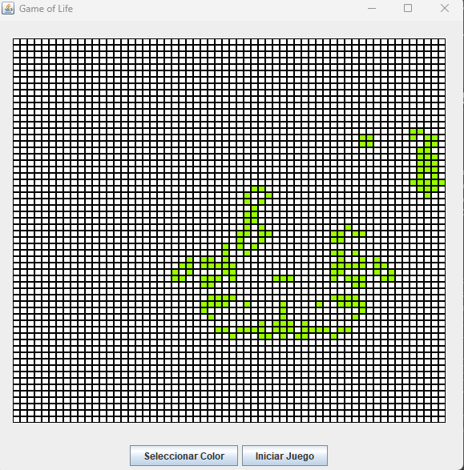

# GameOfLife

## Descripción del Proyecto
Este proyecto es una implementación del famoso Juego de la Vida de Conway, utilizando Java Swing para crear una interfaz gráfica. Se ha desarrollado usando JDK 21 y NetBeans 19.

## Reglas del Juego de la Vida 🌱
El Juego de la Vida es un autómata celular que simula la vida en un entorno bidimensional. Aquí están las reglas básicas:
- Células Vivas: Representadas por un color (por ejemplo, negro) y pueden "vivir" o "morir" dependiendo de sus vecinas.
- Células Muertas: Representadas por otro color (por ejemplo, blanco) y pueden "revivir" bajo ciertas condiciones.

## Reglas de Evolución 🔄
- Supervivencia: Una célula viva con 2 o 3 vecinas vivas permanece viva.
- Muerte: Una célula viva con menos de 2 vecinas vivas muere por subpoblación. Una célula viva con más de 3 vecinas vivas muere por sobrepoblación.
- Nacimiento: Una célula muerta con exactamente 3 vecinas vivas se convierte en una célula viva.

## Características del Proyecto ✨
- Interfaz gráfica intuitiva y fácil de usar.
- Permite al usuario modificar el estado actual de las células haciendo clic en ellas.
- Visualización animada del área de vida, mostrando cómo evolucionan las células con el tiempo.